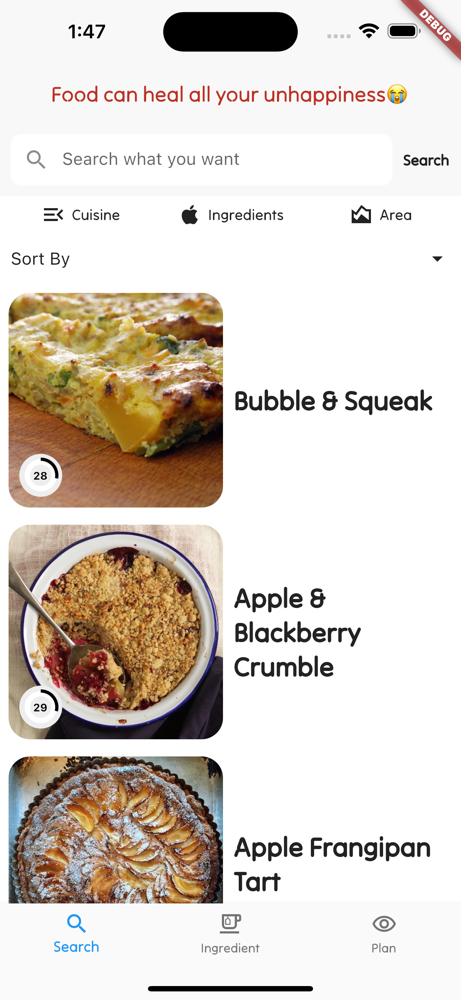
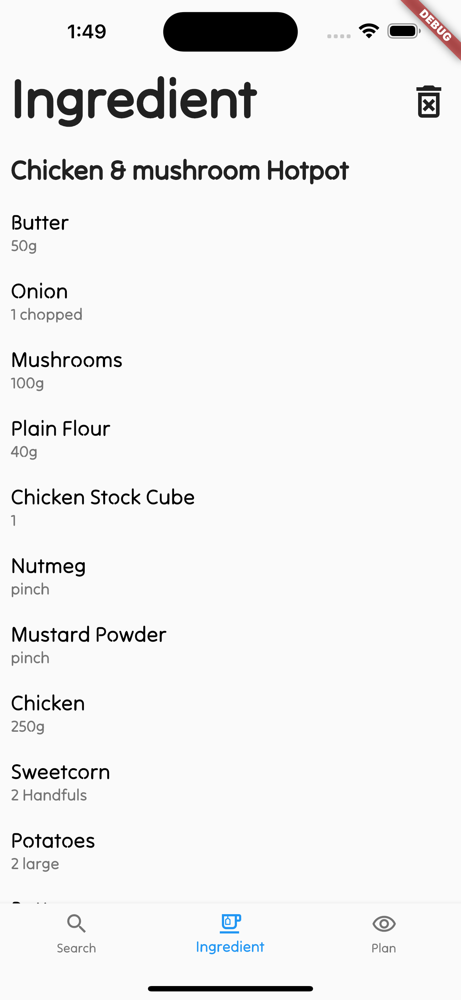
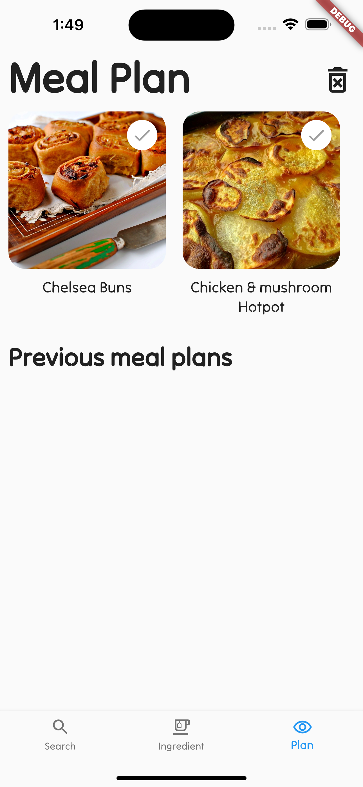

# Lazy meal - Search recipes to build a meal plan

The application allows users to search for desired recipes based on the cuisine, ingredients and area, as well as sorting recipes by popularity and newest. The selected recipes can be added to a meal plan or the required ingredients can be added directly to the ingredients list. Selected recipes can be viewed by switching pages via the navigation bar and the user can manage what is added on the ingredients page and the plan page.

## Features 
Search page: Users can enter content in the search box above and select criteria to search and sort recipes.
The crying face emoji at the top means that the meal plan has not been added today and will change to a smiley face when added.

Details page: view recipe details. The star button on the top right adds the recipe ingredients to the ingredients list and the eye button adds the recipe to the plan.

Ingredient list page: view the ingredients that have been added. Users can delete individual ingredients by swiping right, or delete all ingredients by using the bin button at the top right.

Plan page: view the recipes that have been added. Users can click on a recipe to indicate that it is complete or delete all recipes via the bin button at the top right.

- https://github.com/miickel/flutter_particle_clock
- https://github.com/Tarikul711/flutter-food-delivery-app-ui    
- https://github.com/mohak1283/Instagram-Clone

## Data Feed

## How To Install The App

Include a section that gives intructions on how to install the app or run it in Flutter.  What versions of the plugins are you assuming?  Maybe define a licence

## License

## Contact Details

Having Contact Details is also good as it shows people how to get in contact with you if they'd like to contribute to the app. 
